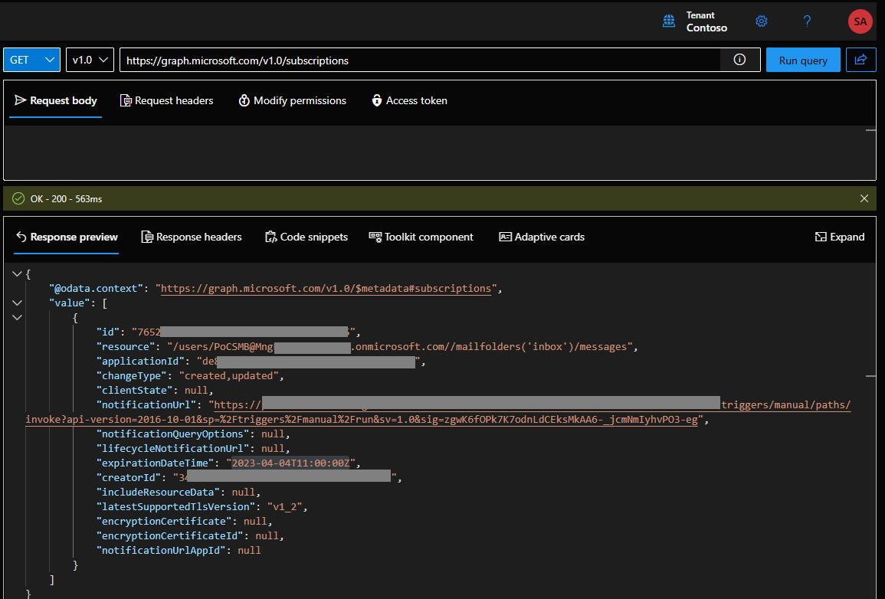

# Graph Subscriptions
For some of the examples you will need to create a Graph Subsciption.  Below are some examples of the subscriptions that need to be created for the examples provided in this Repo

# Important Notes
Graph Explorer is a handy tool and should be used to test the various endpoints and operations.  
| **Description**    | **Link**                                                       |
| ---                | ---                                                            |
| Graph Explorer     | https://developer.microsoft.com/en-us/graph/graph-explorer     |

# Examples
### Creating a Change Notification for subscription for emails in a Shared Mailbox ###

### Get a list of Graph subscriptions ###
1. Navigate to (https://developer.microsoft.com/en-us/graph/graph-explorer) and make sure you are logged-in to an account that has permissions to Graph.
2. Send a GET request to the subscriptions endpoint https://graph.microsoft.com/v1.0/subscriptions.  Below is an example.

If you have any subscriptions they will be noted in the Response Preview Window.
